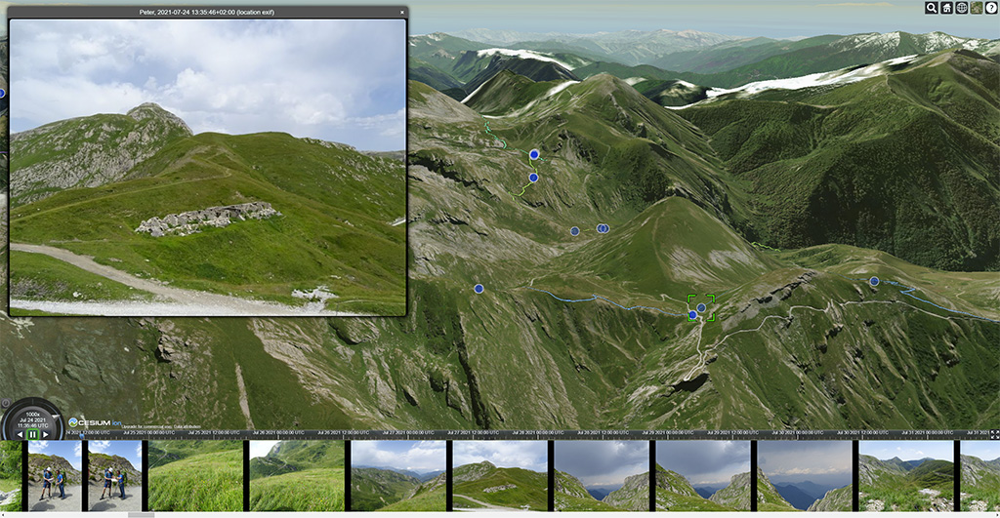

# Cesium Travelmap

Display photo locations and GPS tracks on an interactive map and timeline.

If GPS information is not available in a photo, the time and GPS track will be used to position the photo on the map.



In short:
1. ExifTool is used to extract photo GPS data and date & time to a CSV file.
2. A Python script combines one or more CSV files and GPX tracks and generates a CZML file that contains the paths and markers to display.
3. CZML is read by the Cesium-based web application and displays the tracks and photo locations on the map.

## Prerequisites

For preprocessing the data:
* [ExifTool](https://exiftool.org/)
* Python 3

For building / developing the application:
 * Node + npm

The built application can be statically served, e.g. with nginx

## Configuration

Create a .env file with the following information:

```
# Cesium base url
CESIUM_BASE_URL=/

# Your cesium token, get one at https://cesium.com/learn/cesiumjs-learn/cesiumjs-quickstart/
CESIUM_TOKEN=

# Directory containing the tracks and photos, used for preprocessing
DATA_DIR=/path/to/data

# Directory where exiftool is installed
EXIFTOOL_DIR=/opt/Image-ExifTool-12.21
```

## Preprocess data

DATA_DIR is the base data directory, KEY_DIR is used to support multiple datasets on the same server. The name of KEY_DIR can be anything and can be generated randomly to make it harder to find.

Put the gpx files in DATA_DIR/KEY_DIR/tracks.

Put series of photos in separate folders. One folder for each author or source is recommended. Each of these folders should be under DATA_DIR/KEY_DIR/photos/.

In each folder, put a config.cfg file with some settings specific for this set of photos. `attribution` is the author or source of the photo and `delta.hours` and `delta.minutes` are used to correct the photo time. The `ignore_duplicate_exif_coords` flag can be set to ignore EXIF coordinates which are duplicates of other photos (which can indicate reduced accuracy, in which case we want to use another method for coordinates). Optionally, any photo coordinates can be manually specified in the `manual_coords` section. Coordinates are longitude, latitude, altitude (note the order!). Photos for which no coordinates can be determined (because they lack the GPS information or they are outside the GPX track time-wise) will be discarded.

```
[global]
attribution=Peter
delta.hours=1
delta.minutes=0
ignore_duplicate_exif_coords=False

[manual_coords]
DSC03150.JPG=7.62354,44.06445,777.4
DSC03151.JPG=7.62354,44.06446,777.4
```

Execute the preprocessing script:
```
python3 preprocess/gpx2czml.py key
```
This will perform a number of tasks:
* Run exiftool for each directory with photos. This will generate a csv file with all the required information extracted from the photos.
* Combine all GPX tracks and photo information into one CZML file (DATA_DIR/KEY_DIR/combined.czml) that can be visualized.

### How are photo coordinates determined?

The algorithm goes through the following steps to determine the coordinates and uses the first that applies:

1. If a photo has its coordinates specified manually in the config.cfg (photo folder), those coordinates will be used. See `manual_coords` above.
2. If a photo has GPS coordinates in the EXIF tags, that will be used, with the following exceptions:
   1. `ignore_duplicate_exif_coords` is set to True in the config.cfg and the coordinates are found to have duplicates (which can indicate bad accuracy).
   2. `ignore_exif` contains the photo filename (comma-delimited list) in the config.cfg.
3. The coordinates will be interpolated between the closest track points time-wise, with the following exceptions:
   1. If the photo time falls in a `ignore_gpx_intervals` interval and has a matching directory name.
   2. If the photo time falls outside the tracks.
4. The coordinates will be interpolated between the closest photos time-wise. If the photo was "excluded" before because of it falling in one of the ignore_gpx_intervals, it will only consider the photos in the specified directory names for that interval for interpolation.

## Run the visualizer

Make sure .env contains the correct CESIUM_TOKEN and your data directory is relative to the index.html, at data/

```
npm start
```

Access the visualizer at http://localhost:8081?key=KEY_DIR, where KEY_DIR is the value for the corresponding dataset.
